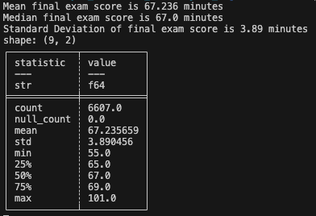

# Kayla_Haeussler_MiniProject_3

IDS 706: Mini Project 3
Polars Descriptive Statistics Script
Kayla Haeussler

The purpose of this assignment was to create a Python script which uses Polars to generate descriptive statistics.

# Assignment Requirements
- Python script using Polars for descriptive statistics
- Read a dataset (CSV or Excel)
- Generate summary statistics (mean, median, standard deviation)
- Create at least one visualization

# Data Set Used in this Project
The data set used in this project, StudentPerformanceFactors.csv, was pulled from kaggle.com, a website offering public domain data sets. This data is described as a "comprehensive overview of various factors affecting student performance in exams", including data for 6,607 students's grade on a final exam as well as information on various factors that may affect their exam performance, such as # of hours studied, percentage of classes attended, parental involvement (Low, Medium, High), and many others.

# Example Summary Statistics
Example output generated by the get_summary_stats function in main when the column of interest is "Exam_Score"

# Example Data Visualizations
Histogram of final exam scores generating using the create_scatter function in main.py

Scatter plot demonstrating the relationship between hours studied and the final exam score received

